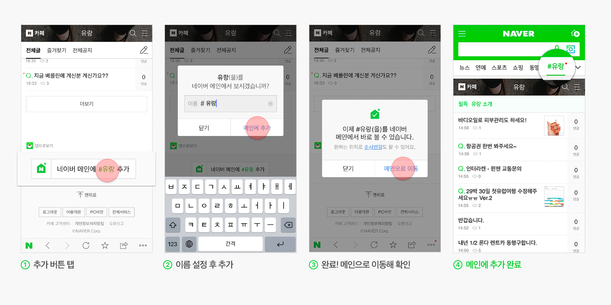
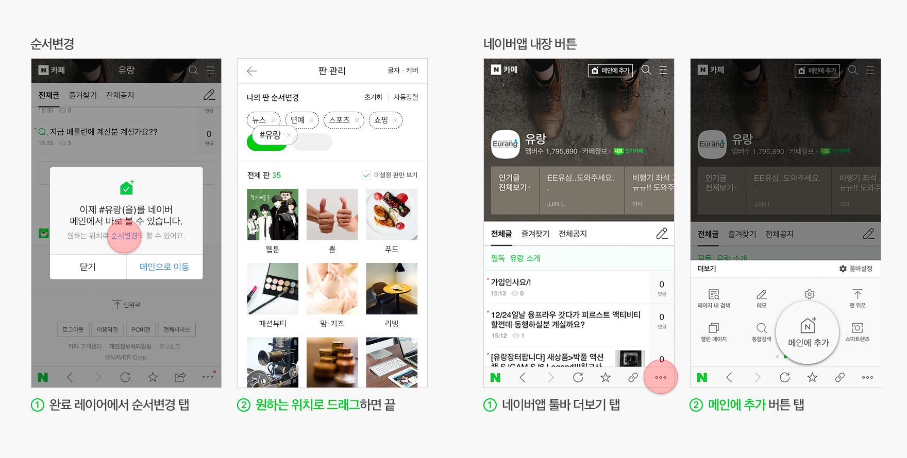
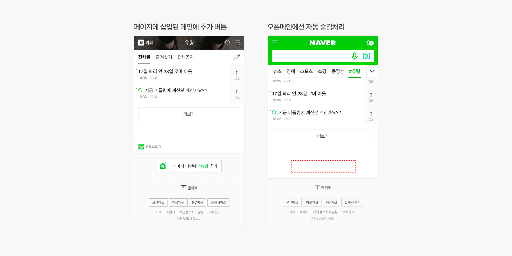

# 네이버 오픈메인


오픈메인의 추가 버튼은 여러분의 사이트를 네이버 메인에 쉽게 추가할 수 있게 해주는 플러그인입니다.
간단한 스크립트를 복사해 붙이는 것만으로도 쉽게 개발할 수 있습니다.
버튼은 모든 모바일 환경을 지원하며 추가된 모습은 네이버앱에서 확인할 수 있습니다.

[[TOC]]


<br/>
<br/>
<br/>

# 1. 오픈메인 사용 시나리오

페이지에 부착된 메인에 추가 버튼을 누르면 레이어가 발생되며 이름 입력 후 메인에 추가 버튼을 누르면 추가가 완료됩니다.  모바일웹에서 시도하면 네이버앱을 실행시켜 레이어를 띄워줍니다.




추가된 오픈메인은 원하는 위치로 순서 변경할 수 있고 최대 30개까지 추가할 수 있습니다. 네이버앱에 내장된 버튼으로도 오픈메인을 추가할 수 있습니다.




<br/>
<br/>
<br/>

# 2. 추가버튼 모바일웹 개발 가이드

javascript 버튼으로 모든 모바일웹 환경에 적용 가능하며 스크립트 호출 시 네이버로 연결되는 시나리오가 자동으로 실행됩니다.

## 2.1 오픈메인 선언

### 2.1.1  환경 선택

개발 환경에서 테스트할 목적이라면 개발 환경을, 실제 서비스에 적용할 목적이라면 서비스 환경을 선택하세요.
<div class="blockquote_area openmain-select mobile-head">
<label><input type='radio' name='mobie-head'>개발 환경 - https://test-openmain.m.naver.com/js/openmain.js</label>
<label><input type='radio' name='mobie-head'>서비스 환경 - https://openmain.pstatic.net/js/openmain.js</label>
</div>

### 2.1.2 미리보기 및 코드복사

소스코드에 출력된 플러그인 코드를 복사해 개발합니다.
html 페이지 내부 </body> 태그를 닫기 직전에 오픈메인 스크립트를 삽입하세요.

<div class="openmain-code mobile-head">
<textarea readonly hidden>
<script type="text/javascript" src="https://test-openmain.m.naver.com/js/openmain.js"></script>
</textarea>
<textarea readonly hidden>
<script type="text/javascript" src="https://openmain.pstatic.net/js/openmain.js"></script>
</textarea>
<pre>
<code>
</code>
</pre>
<button class="button-green btn-copy">
<i class="xi-documents-o"></i> 복사하기
</botton>
</div>

## 2.2 버튼 출력

### 2.2.1 이름 (data-title)

코드를 정의할 때 data-title 값에 오픈메인 이름을 지정할 수 있습니다. 
별도의 지정이 없다면 기본 값이 적용됩니다.

<div class="blockquote_area openmain-select data-title mobile-btn">
<label><input type='radio'/>기본값 (title요소값> og:title 값> 빈 문자열)</label>
<label><input type='radio'/><input type="text" placeholder="6자이내 입력" maxlength="6"/></label>
</div>

### 2.2.2 URL (data-url)

코드를 정의할 때 data-url값에 원하는 링크를 지정할 수 있습니다. url은 http, https 등의 프로토콜을 포함한 전체 URL을 삽입합니다. 단, **버튼이 포함된 웹페이지의 도메인과 data-url값이 다른 경우 기능이 제한될 수 있습니다.**

<div class="blockquote_area openmain-select data-url mobile-btn">
<label><input type='radio'/>기본값 (버튼이 포함된 페이지의 실제 URL)</label>
<label><input type='radio'/><input type="text" placeholder="프로토콜 포함 URL"/></label>
</div>

### 2.2.3 버튼 디자인 (data-type)

코드를 정의할 때 data-type 값에 버튼 디자인을 지정하면 원하는 버튼을 웹사이트에 적용할 수 있습니다.
버튼은 다음 세가지 중 선택 가능합니다.

<div class="blockquote_area openmain-select data-type mobile-btn"><label><input type='radio'/></label><label><input type='radio'/></label><label><input type='radio'/></label></div>

### 2.2.4 미리보기 및 코드복사

소스코드에 출력된 플러그인 코드를 복사해 개발합니다. html 페이지에 버튼을 삽입하고자 하는 영역에 div 요소를 삽입하세요. 실제 버튼이 위치할 공간에 아래 코드를 넣어주세요. 여백 등 버튼의 세부 스타일은 버튼이 적용된 모습을 토대로 개별 페이지에서 작업해 주셔야 합니다.
버튼은 여러개 등록할 수 있습니다. nv-openmain 클래스를 포함한 모든 div 요소에 버튼을 그립니다.

<div class="openmain-code mobile-btn">
<pre>
<code>
</code>
</pre>
<button class="button-green btn-copy">
<i class="xi-documents-o"></i> 복사하기
</botton>
</div>


<br/>
<br/>
<br/>

# 3. 오픈메인용 query parameter

네이버앱에서 오픈메인 페이지 로딩 시 서비스 url에 네이버 메인 호출임을 구분하기 위한 query parameter를 추가합니다. 이 query parameter로 각 서비스에서는 오픈메인일때 분기를 태워 오픈메인에 적합한 페이지를 사용자에게 제공할 수 있습니다.

| parameter  | 예시 |
|:--:|-------|
| napp=mysection | http://mnews.naver.com/?napp=mysection |


<br/>
<br/>
<br/>

# 4. 오픈메인 적용 시 유의사항

## 4.1 가로 swipe

네이버앱 메인은 가로 swipe로 메뉴(판)를 이동하기 때문에  페이지 내 가로 swipe는  정상적으로 동작되지 않을 수 있습니다.

### 4.1.1 안드로이드 OS 가로 swipe 동작

페이지의 swipe 를 정상적으로 동작시키려면 보완 작업이 필요합니다. 
페이지의 가로 swipe의 touchdown 이벤트 수행 시 아래 메소드를 호출하면 네이버앱의 swipe는 일시중지되고 페이지 내 swipe 가 실행됩니다.

| 메소드 |
|:--:|
| window.TEvent.touchStartEvent() |

```text
if (네이버앱 && TEvent !==”undefined”) {
   ${dom element}.addEventListener(“touchstart”,function(e){
         TEvent.touchStartEvent();
   }, false);
}
```

### 4.1.2 iOS 가로 swipe 동작

iOS는 페이지에 포함된 부분 컴포넌트의 가로 swipe는 별도의 보완작업 없이 정상적으로 동작됩니다. 단 페이지 전체 가로 swipe는 제한됩니다.


## 4.2 position- fixed element (안드로이드OS) 레이아웃 깨짐 현상

페이지에서 position- fixed element를 사용할 경우 안드로이드 네이버앱 오픈메인의 레이아웃이 깨질 수 있습니다.


## 4.3 리다이렉트 제한

오픈메인은 어뷰징을 방지하기 위해 동일 도메인이 아닌 경우 리다이렉트를 제한하고 있습니다.  리다이렉트 시도 시 새 창이 뜨거나 페이지가 차단될 수 있습니다.


## 4.4 버튼 자동 숨김 처리

오픈메인 로딩 시 [메인에 추가] 버튼은 자동으로 숨김처리됩니다. 숨김처리 시 버튼을 위해 잡아 둔 공간이 비어보일 수 있습니다. 필요 시 오픈메인용 Query parameter를 활용해 불필요한 공간을 제거할 수 있습니다.




## 4.5 기타

안드로이드 네이버앱은 메인 노출을 위한 최적화 작업이 수행된 후 오픈메인이 로딩됩니다.
오픈메인을 통한 유입이 증가하면 페이지 트래픽이 증가될 수 있습니다.


<br/>
<br/>
<br/>

# 5. [참고] 네이버앱 구분 방법

4.1의 네이버앱은 네이버앱에서의 웹페이지 로딩을 의미합니다.
네이버앱 웹페이지 로딩여부는 request header 의 userAgent 값으로 구분할 수 있습니다.
안드로이드 OS는 2가지의 웹뷰가 있으며 각기 다른 userAgent를 가지고 있습니다.

| 환경 | 패턴 | 예시 |
|---|-----|-----|
| 안드로이드 OS 시스템 웹뷰 | NAVER (inapp; search; 코드; 앱버전) | NAVER (inapp; search; 550; 8.2.0) |
| 안드로이드 OS 네이버앱 웹뷰 | NAVER (higgs; search; 코드; 앱버전; 웹뷰버전) | NAVER (higgs; search; 550; 8.2.0; 20.50.533.26) |
| iOS | NAVER (inapp; search; 코드; 앱버전; 기종) | NAVER (inapp; search; 550; 8.2.0; 7PLUS) |
